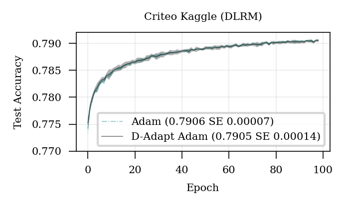

# D-Adaptation
[](https://pepy.tech/project/dadaptation) [](https://pepy.tech/project/dadaptation)

Learning rate free learning for SGD, AdaGrad and Adam! 

*by Aaron Defazio and Konstantin Mishchenko [(Arxiv)](https://arxiv.org/abs/2301.07733)*

``` pip install dadaptation ```

**NEW V3.0 release uses an improved algorithm that may give different results from past versions. The old version is still availiable under experimental/d_adapt_adam_preprint.**

## NEW: Prodigy
We have recently released the [Prodigy](https://github.com/konstmish/prodigy) method, which grows the adapted learning rate faster than D-Adaptation in theory and practice. Try it out if D-Adaptation is under-estimating the learning rate.

## How To Cite
If you use D-Adaptation in a publication, please cite our work as 
```
@ARTICLE{defazio2023dadapt,
author = {Aaron Defazio and Konstantin Mishchenko},
title = {Learning-Rate-Free Learning by D-Adaptation},
journal = {The 40th International Conference on Machine Learning (ICML 2023)},
year = {2023}
}
```

## Details

The provided Pytorch Optimizer classes are drop-in replacements, either copy into your project or use via pip with dadaptation.DAdaptSGD,  dadaptation.DAdaptAdam or dadaptation.DAdaptAdaGrad.

 - **Set the LR parameter to 1.0**. This parameter is not ignored. Setting it larger to smaller will directly scale up or down the D-Adapted learning rate estimate.
 - Different per-layer learning rates can be achieved by setting the layer_scale value in each parameter-group. It defaults to 1.0, and scales each layer's learning rate relative to the other layers.
 - **Use the same learning rate scheduler you would normally use on the problem.**
 - The Adam variant supports AdamW style weight decay, just set decouple=True. It is not turned on by default, so if you are replacing your adam implementation, make sure you use decoupled if necessary.
 - It may be necessary to use larger weight decay than you would normally use, try a factor of 2 or 4 bigger if you see overfitting. D-Adaptation uses larger learning rates than people typically hand-choose, in some cases that requires more decay.
 - Use the log_every setting to see the learning rate being used (d*lr) and the current D bound.
 - Only the AdaGrad version supports sparse gradients. It does not adapt as efficiently as the other variants and should be considered experimental.
 
## Change Log

### Version 3.2
 - Added support for layer-wise scaling to DAdaptAdam.

### Version 3.0
 - Major improvements to DAdaptAdam, improving the performance particularly on Transformer models. This variant may behave differently in practice. The old version is availiable under experimental/d_adapt_adam_preprint if you wish to continue to use it.
 - The IP variant is now the main variant of the method.
 - Added Lion. This is highly experimental. Feedback on it's performance is welcome.

### Version 2.0
 - Added Adan - should still be considered experimental.
 - Added support for PyTorch's Fully Sharded Data Parallel. 
 - Improved support of edge cases such as learning rate zero.
 - Improved logging - uses Python logging rather than print statements

 # Experimental results




# License
See the [License file](/LICENSE).
