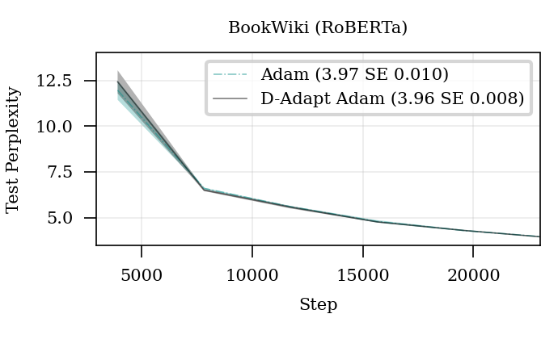
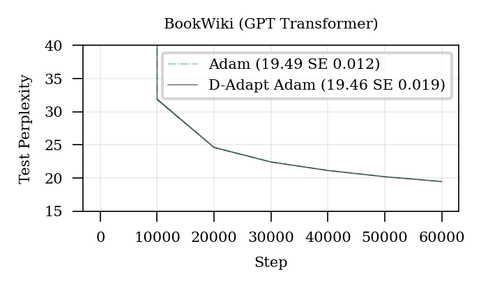

# D-Adaptation

Learning rate free learning for SGD, AdaGrad and Adam! 

## Details

The provided Pytorch Optimizer classes can be dropped into your project and used as normal.

 - **Set the LR parameter to 1.0**. This parameter is not ignored, rather, setting it larger to smaller will directly scale up or down the D-adapted learning rate. 
 - If you encounter divergence early on, try change rho to match a reasonable warmup schedule rate for your problem.
 - **Use the same learning rate scheduler you would normally use on the problem.**
 - The Adam variant supports AdamW style weight decay, just set decouple=True. It is not turned on by default, so if you are replacing your adam implementation, make sure you use decoupled if necessary.
 - Use the log_every setting to see the learning rate being used (d*lr) and the current D bound.
 - Only the AdaGrad version supports sparse gradients.
 - The IP variants implement a tighter D bound.

 # Experimental results

# License
See the [License file](/LICENSE).
